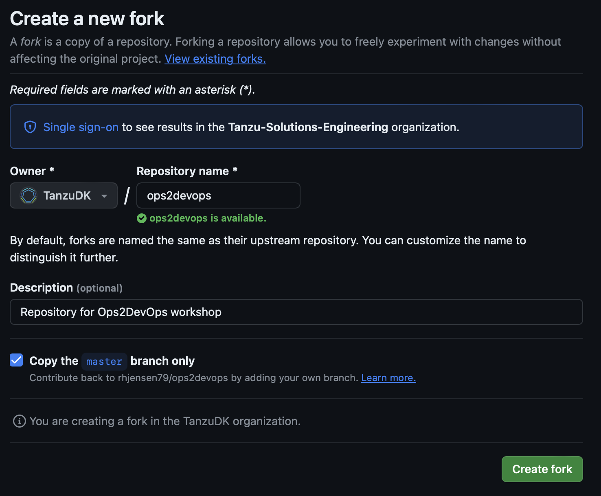
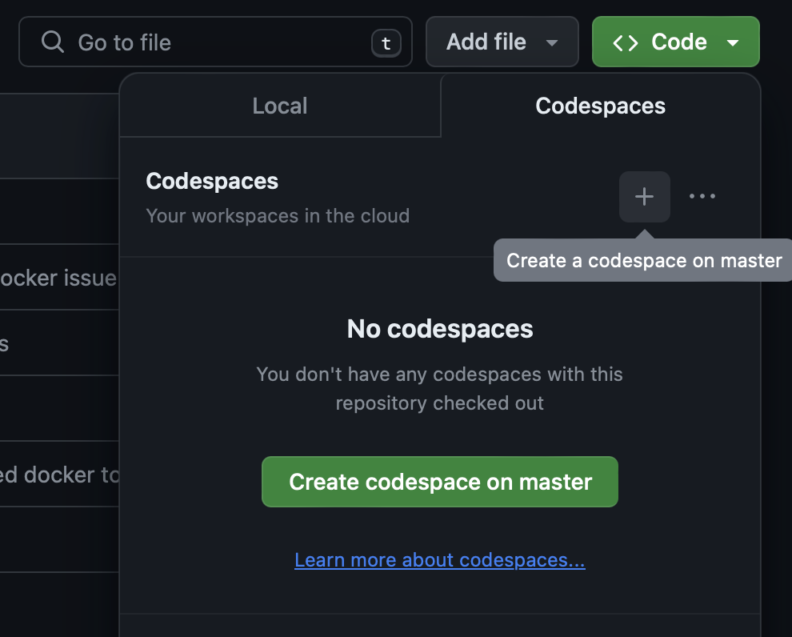
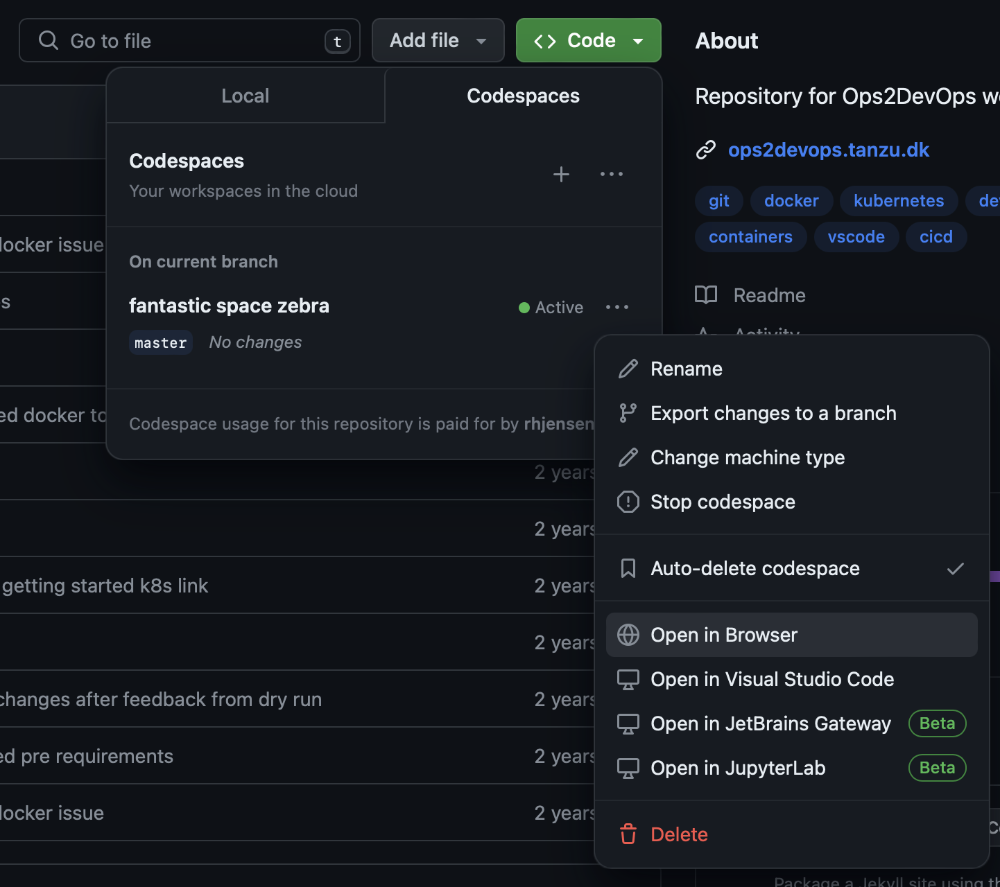
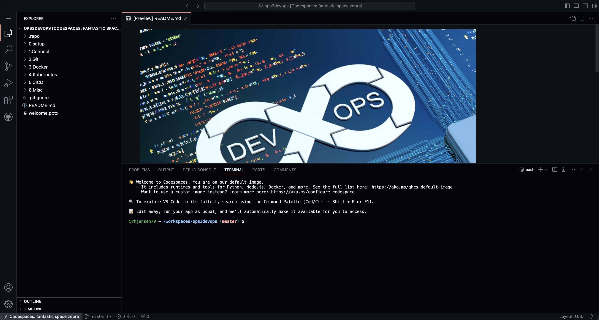

# 1. Connect

### The purpose of this task, is to fork the repository, and connect to the demo enviroment.
 

## Open Github

- If you havent already done so, the open [https://github.com/rhjensen79/ops2devops](https://github.com/rhjensen79/ops2devops) and login using your Github account.

- Click fork in the top right corner.
- Select your user, and select `Create Fork`

- After it's complete, open the new repository. The url is username/ops2devops
- Click the green `code`button, and select the Codespaces tab and click the small `+`button, next to `Codespaces` 

- You might be asked to open in VScode. Only do this, if you are sure of what you are doing. Our focus in this lab, is running it in the browser.

- After a couple of minutes, refresh the browser, select the `code`button, the `codespaces`tab and click the `...`next to the custom name.
- From the dropdown menu select `Open in browser`

- You should now have a full working Codepspace enviroment, running in your browser.

