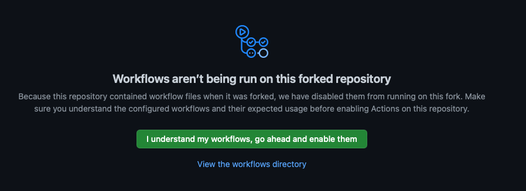
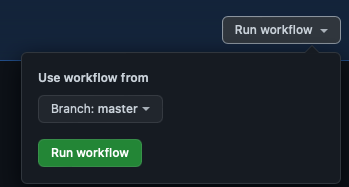

# Getting started with Git (Remote)

## Fork Repository

- Open browser on https://github.com/TanzuDK/ops2devops

- Make sure you are logged in.

- Click Fork in the top right corner

- Select your user

- Check that you are in your forked repository. 

- The name should be githubusername/ops2devops

- Click the green Code button

- Select https

- copy the url

## Clone Repository

- Open VSCode
- Make sure you are not in the existing folder, vi created earlier, but insted in in the root home folder /home/ubuntu

- Run `cd /home/ubuntu`if you are in doubt in the VScode terminal window.

- Run `git clone CopyedURL`
- Open the new folder in VSCode - Top Menu -> File ->Open folder
- If presented by a security warning, accept that you trust the folder and all subfolders.

- You now have a local copy, of the forked Public git repository for this workshop, and you are running VS code, from that repository, on the remote server.
## Enable Actions

- To prepare for a later step, open the Action tab, in your new forked repository page on Github.
- Click The green button, to confirm you accept and want to enable actions.

- Click 4-k8s-1 and select run workflow, on the right.
- Click the green `Run Workflow` button.

## Save changes

- To save any changes you do in this repository, you need to commit and push them back to the repo, or else, they will be lost, when this VM get's deleted, after the workshop.

### `Please commit and push, after you finish every step. It's good practice, and it also helps, trigger some of the workflows, needed in later steps, in this workshop.`
