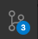

# 3. Task - Getting started with Git 

## Saving/committing data

- We will now make changes to this forked version of your repository, and push it to Github, using VSCode.
- Create a file in the root of the the repository, called servers.txt
- Add the following to the file : 
    - Student number (Type `ifconfig` and note the last number in your ip, of eth0 (Example 10.0.1.10 - Student number = 10))
    - Public ip of your student vm
    - Public ip of K8S server
    - Private IP of the K8S server (it's 10.0.1.9).
- Save the file.
- Note that a blue icons with a number, on the Soruce control icon, on the left. This means that there are changes to the repository, that is not committed yet.

- Click the icon.
- You should see a list of files that has been changed. 
- On the top, there is a message box. Type a commit message into this like "Added server information" and press `ctrl + enter`
- The changes is now committed. Note the commit is still local, and not pushed to the remote repository on Github. 
- To push it remote, click the 3 `...` in the top, and select `Push` or find the 2 round arrow symbol, in the bottom, and click this, to sync both ways. 
- Your changes are now committed, and pushed. 

# Install Git Graph in VSCode

- Open settings -> Extentions in VSCode
- Search for `Git Graph` and install it.
- After install go to the `Source Control` icon, and find the small Git Graph icon, to the right of `Source Control`
- This opens up a graphical view, that shows your different commits/Branches etc. 
- You can click each commit, and see what changes was done.
