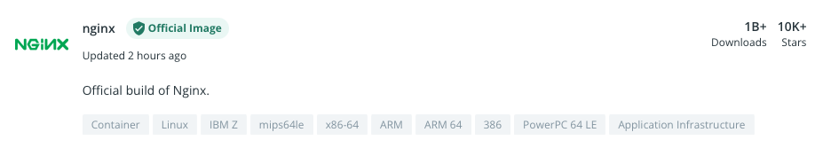

# 1. Task - Dockerfile

## Docker Hub

- Open [https://hub.docker.com](https://hub.docker.com)
- Search for `Nginx`
- Click on the `Official Image` (should be the one on top)

- Go thru the documentation in class :
    - Official Image
    - Reference
    - Tags
    - Image variants
    - OS/Arch
    - Use of the image (Examples)

## Dockerfile

- Open the `Dockerfile` in VSCode
- Go thru the different options
    - FROM
    - WORKDIR
    - RUN
    - COPY
    - EXPOSE
    - CMD

## Build Container

- If you don't already have a terminal, in the `3.Docker/1.Task directory`, then right click the directory on the left, and select `Open in integrated terminal`
- This opens a terminal, in the correct directory. Change directory, for each task, either by command, or by doing the above step, each time you progress.
- Run `docker build -t web:v1 .` (Note the . in the end)
- Watch the build finish
- When it's done, you should read `Successfully tagged web:v1`
- This means you build a local container, named web:1
- Run `docker image ls` to see the images local on the machine
- Note you will see both the Web container, and the nginx container, that the web container was build on. As part of this workshop, where will also be a couple of other images, that all start with registry.tanzu.dk, but that is for a later step.

## Run Container

- Run `docker run -p 80:80 web:v1`
- open a browser to the public ip of your student VM, from your local machine `http://studentip:80`
- See the website that is running :-) 
- Note that when you connect to the website, the logs from the container, is updated in the console. 
- Stop the container pressing `ctrl + c`

## Make Changes

- Edit `html/index.html` by replacing the `Student xxx` with your name.
- Build a new version of the container, by running `docker build -t web:v2 .` 
- Run the new version `docker run -p 80:80 web:v2`
- open a browser to `http://studentip:80` and see that the content has changed.
- Stop the container again by pressing `ctrl + c`

## See the different images

- run `docker ps -a` and see that you have 2 versions of the `web` container.
- Note the names is auto generated, to make sure there is no conflick between them.
- Also note, that this is the actual containers, that are build on the images. You can have multiple containers, build on the same image.